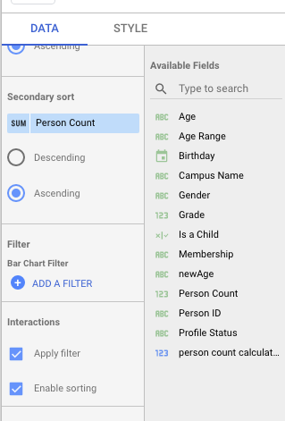
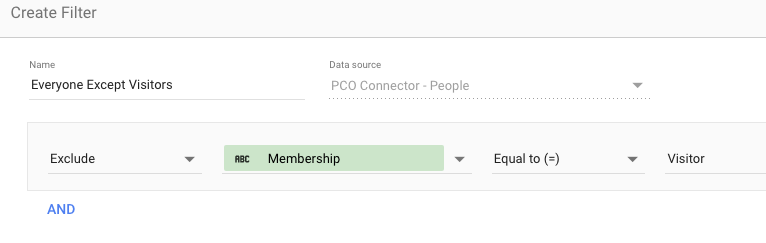
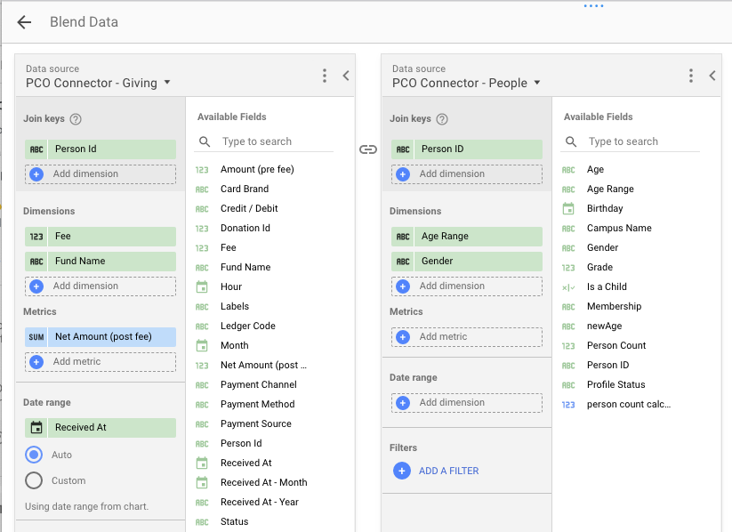
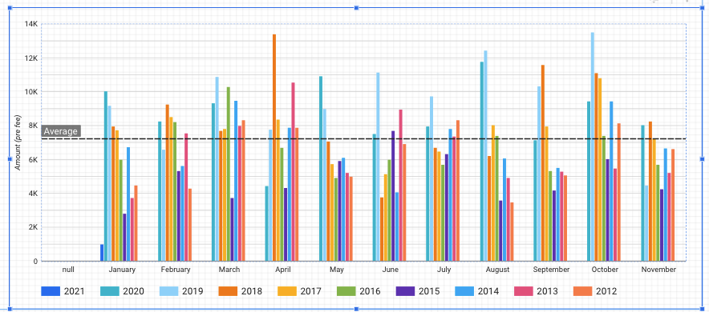

# Google Data Studio

For in-depth Google Data Studio help you can use their support community [here](https://support.google.com/datastudio).

## Using The Template:

This template is not designed to meet 100% of your needs. It's designed to be a quick way to get your metrics off the ground and provide some basic help with setting up. **As you set up more, we'd love to hear your best metrics and charts so we can share them with others!**

1. First, you'll want to configure each of the connectors that you will be using in the [Initial Setup guide](initial-setup.md#step-3-configure-your-google-data-studio-connectors).
2. Next, Navigate to this [link](https://datastudio.google.com/u/0/reporting/a7bc8f59-9cb4-4a2b-b5ce-cfbd6c977adc/page/YDvvB). It might take a moment to load as it's pulling test data.
3. Click the copy icon on the top right \(see image below with questions\)
4. Configure the data sources that you'll be using \(see image below with questions\)
   * if there are any data sources that you do not plan on using, simply leave those blank and you can delete the charts that utilize that data source.
5. Click 'Copy Report.

## Filtering data with fields

Filtering your data will allow you to view the chart or data with higher levels of customization. An example would be if you want to view giving but filter out anyone with the membership status of "visitor". You can filter your data directly on the chart you would like this to show on.

1. Click on the chart you want to edit.
2. On the config screen on the right, you should see **Filter** where you can click **ADD A FILTER**.

    

3. Now click **Create A Filter**
4. Name the filter something you'll recognize later.
   * For our example, we'll call it "Everyone except visitors"
5. Now think of this as a sentence for who you want or don't want.
   * _see the image below for step 5._
   * For our example, we'll do "Exclude **Membership** Equal to \(=\) Visitor"
   * You can stack these statements to be as many as you'd like, similar to PCO Lists.
   * **If you do not see the value you're trying to filter by, ensure you're using the right Data Source. If it's a blended data source, ensure you've added that field to the blended data.**
6. Now click **Save**
7. Now you should see a list of your filters. Simply click the filter you want to apply and your data will refresh.

## Creating additional Metrics

Sometimes the basic metrics that are provided are not enough and you'd like to add some more. Luckily, with Google Data Studio this process is fairly simple and doesn't require much from you.

You'll want to reference Google's Documentation [here](https://support.google.com/datastudio/answer/9152828?hl=en&ref_topic=7570421).

#### To edit your metrics within a GDS Dashboard:

1. Open your GDS dashboard and click **Resources** &gt; **Manage Added Data Sources** &gt; **click the pencil next to the source you want to edit**
2. From here, click **Add a Field** on the top right
3. This will bring up the field editor. You'll want to give it a memorable name under **Field Name**
4. You'll build your formula similar to how excel / Google Sheets works on a formula.
   1. This does have limited functions that you can use in these calculated fields - [Function List](https://support.google.com/datastudio/table/6379764?hl=en)
5. Input your formula in the field and click save.
   1. For more on formulas for GDS go [here](https://support.google.com/datastudio/answer/6299685?hl=en&ref_topic=7570421).
6. You'll want to give it the proper **type** based on the kind of information it is.
7. Now click **Done** 

## Blending Data Sources

One of the primary benefits of building the integration with Google Data Studio and the People IDs is that you can blend your data across Planning Center modules to create new and unique ways of viewing your data!

#### Steps to Blend:

1. Open your GDS dashboard and click **Resources** &gt; **Manage blended data**
2. Here we can click **Add a Data View** in order to blend your data
3. When blending data you need to think of three things:
   1. What's your primary data source?
   2. What are the join keys between the data? At least one is required. We suggest People ID if it's available.
   3. What data from each source will you add? We suggest the minimal amount you need from each source.
4. Now that you answered the above questions go in and add a **Join Key**. This is the **shared** data between the two sources.
5. Now add each dimension/metrics you want within this connector.
6. Lastly, add a date range. We suggest only using a date range from a single source, not both.
7. Click **Save**
8. Now you can add this to a chart like you would any data. 


Pro tip: If you're making multiple charts with blended data you can create a few data blends to share so you don't have to remap each time you create a new one.


  

## Adding Averages

Adding averages within your GDS charts will allow you to see a straight line average of your metrics to truly understand the numbers.

To add averages you'll need to be using a ****combo chart, bar chart, or line chart. You cannot use the stacked charts.

To add this:

1. Click on a chart where you want a line average
2. Click **style** on the chart settings
3. Scroll down to  **Reference Lines**
4. Click **Add a reference Line**
5. Under the **type** click **Metric.**
6. Now you'll need to configure the calculation, label, and anything else. You should see this bar visible right away.

## FAQ

### Can I customize the fields I report on?

YES! That's one of the biggest reasons this integration was designed in the way it is. We have provided a base for you to report and visualize. However, you can build additional fields to show your data in new and unique ways. If you have something that you think everyone would benefit from, share your idea with us at hello@savvytoolbelt.com.

