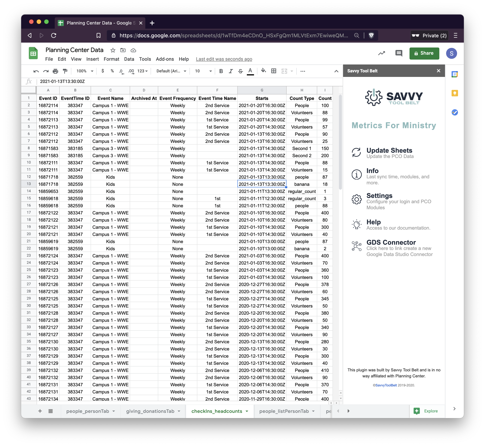

# Check-ins


**No** personal information is stored about your check-ins within Google Sheets. This is by design to keep everything as anonymous as possible when viewing and sharing data.

**You are required to be a Check-in Admin for this connector to work.**


The PCO Check-ins connector supports downloading your headcounts in a list. 

### Setup

Enable this module within the **Settings** screen of the sidebar. You can follow the instructions in [step 2 of the configuration guide](https://docs.metricsforministry.com/initial-setup#step-2-configure-metrics-for-ministry).

### Ideas to Use

These are just some ideas and by no means the only way to use this information. If you find new and creative ways to look at your data we would love to hear from you! Email us at [hello@savvytoolbelt.com](mailto:hello@savvytoolbelt.com)

* Log attendance based on Event name and week.
* Track a total number of volunteers, regulars, guests, and more based on the week/month/year.

### **Giving Field Descriptions**

| **Field Name** | **Description** |
| :--- | :--- |
| **Event ID** | Auto-generated ID for each Event. |
| **EventTime ID** | Auto-generated ID for each Event Time. |
| **Event Name** | The Event Name, example: Weekend Experience. |
| **Archived At** | This is the time in which this was archived. You can use this as a filter. |
| **Event Frequency** | The configured frequency for an event. |
| **Event Type Name** | This will be blank if you have not named your times or will show the name of your time from Check-ins. |
| **Starts** | This is your date metric to use. This is in long format and looks like "YYYY-MM-DDTHH:mm:ssZ". |
| **Count Type** | This is the data directly from the headcounts tab. If you have custom headcounts they will also show here. |
| **Count** | Total number of people who are accounted for the headcounts. |

## FAQ

### What if I use headcounts to verify my total check-ins?

This is a common question. If you use headcounts to verify the number of people checked in you will see a duplicate amount of count based on the Event name and week. You can filter this out by creating a filter or parameter within Google Data Studio and unchecking the headcount types you do not want.

[Read more on the Google Data Studio guide about filtering data](https://docs.metricsforministry.com/google-data-studio#filtering-data-with-fields).

## Screenshots

