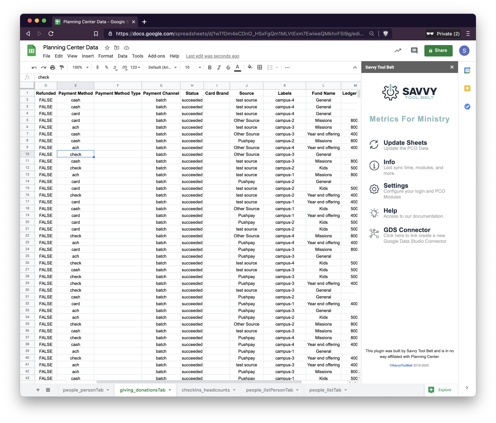

# Giving


**No** personal information is stored about your donors within Google Sheets. This is by design to keep everything as anonymous as possible when viewing and sharing data.

**You are required to be a Giving Admin for this connector to work.**


The PCO Giving connector supports downloading your donations in a transaction list. If your donors give to more than one fund in a transaction you'll see this broken into separate lines.  

### Setup

Enable this module within the **Settings** screen of the sidebar. You can follow the instructions in [step 2 of the configuration guide](https://docs.metricsforministry.com/initial-setup#step-2-configure-metrics-for-ministry).

### Ideas to Use

These are just some ideas and by no means the only way to use this information. If you find new and creative ways to look at your data we would love to hear from you! Email us at [hello@savvytoolbelt.com](mailto:hello@savvytoolbelt.com)

* Viewing your giving by month or week
* Calculating the total fees
* Combining this data with People data to understand giving based on a profile field.
  * Giving based on age
  * Giving based on campus
* Giving based on a list parameter. 
  * You can create a list in PCO and use that as a parameter to filter gifts.

### **Giving Field Descriptions**

| **Field Name** | **Description** |
| :--- | :--- |
| **Donation ID** | A unique ID that's generated per donation. There will be multiple duplicate values for a split donation. |
| **Person ID** | This is the unique value for each person assigned by PCO. |
| **Received At** | This is when the donation was marked as received. Use this as your primary date column. |
| **Refunded** | True / False based on if the amount is refunded or not. |
| **Payment Method** | Card/Cash/Check/ACH. This will be how this was received into PCO" |
| **Payment Method Type** | This will show if the card was credit or debit. |
| **Payment Channel** | Showing if the gift came in through Batch or Stripe |
| **Status** | Payment Status within PCO. |
| **Card Brand** | This is the brand of the card your donor is using. |
| **Source** | These are the payment sources within PCO. |
| **Labels** | If you've assigned a payment a label, you'll get a list of those labels here. |
| **Fund Name** | The Fund Name this donation belongs to. |
| **Ledger Code** | This is the ledger code you've configured in PCO to represent your Chart of Accounts code. |
| **Amount** | This is the gift amount BEFORE the fee is removed. |
| **Fee** | This is the total amount for the fee |
| **Net Amount** | This is the amount after the fee is deducted. |

## FAQ

### How can I use labels?

Currently, labels are downloaded in a list into the label field on Google. If you're looking to filter based on a label with GDS we suggest adding a parameter to filter the data. Find more information on [parameters in the GDS guide](https://docs.metricsforministry.com/google-data-studio#parameters).

## Screenshots

