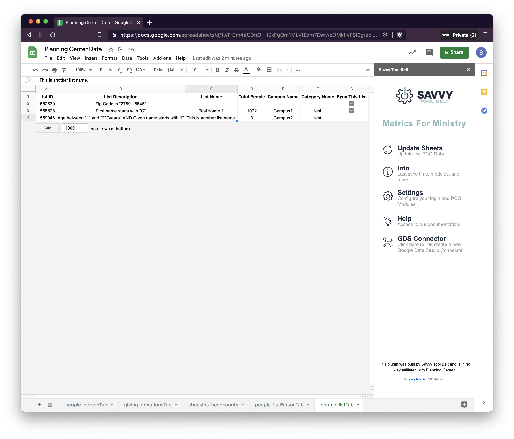
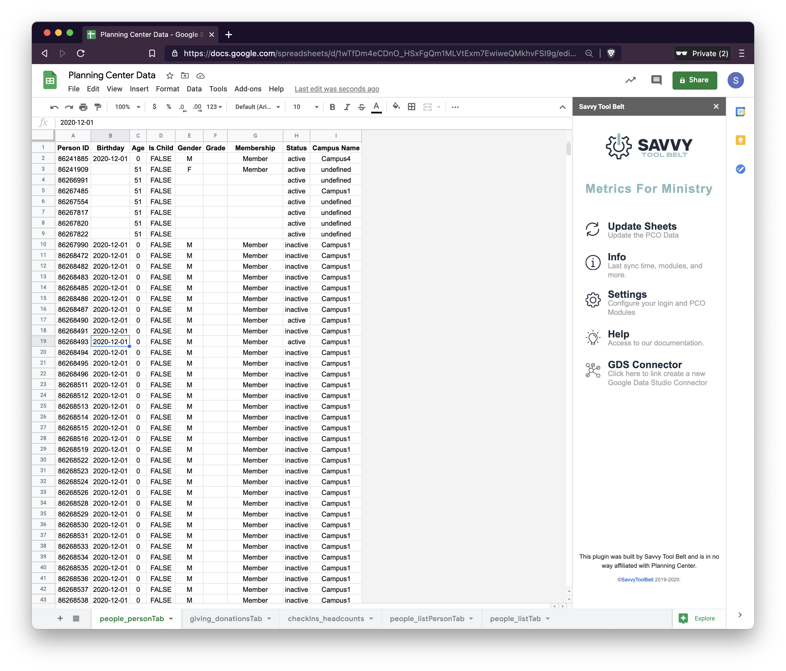
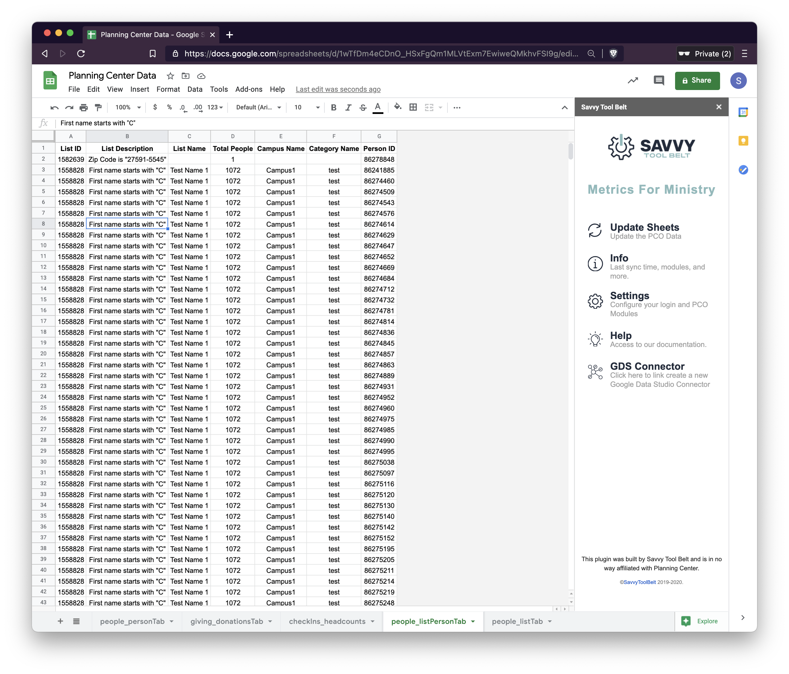

# People

The PCO People connector supports three data types **people**, **lists,** and **list data.** 

The People Connector builds our _baseline_ for our data within this integration. This allows you to filter data based on the unique People data. This unique people data combined with other modules can generate some interesting insights for your church!  
_Ex: Age ranges of people who are giving to your church._ 


No personal information is stored about your people within Google Sheets. This is by design to keep everything as anonymous as possible when viewing and sharing data.


## People Data


This connector is required and automatically configured when you sign in.


### Setup

There is no additional setup for this connector, it works once you've signed into PCO. The moment you click 'Sync Now' it'll begin to populate data. This can take some time based on the number of people in your database.

### Ideas to Use

These are just some ideas and by no means the only way to use this information. If you find new and creative ways to look at your data we would love to hear from you! Email us at [hello@savvytoolbelt.com](mailto:hello@savvytoolbelt.com)

* **Basic metrics** - You can generate basic metrics on your people within People like:
  * \# of each gender
  * \# of each in each campus
  * Age breakdown of each campus.
* **Combined Metrics** - Combining people data with other modules that you have enabled
  * Breakdown of donors by age
  * Giving by membership status

## List Data

List Data is found in two tabs: 

* **List Data**
  * This tab is where the people information will be downloaded once you choose to sync a list.
  * This data only lists a person ID and a list ID. This allows you to link the people / data together in Google Data Studio.
* **Lists**
  * This tab is where the list information is found. Each list within PCO will display here allowing you to configure it.

### Setup

1. For initial setup follow [Step 2 of Initial Setup](https://docs.metricsforministry.com/initial-setup#step-2-configure-metrics-for-ministry).
2. Once you're logged in click the **Sync Lists** button in **Settings**.
   * This will automatically download the lists that are available within Planning Center.
3. If you want to configure specific lists open the tab labeled **Lists**
4. Check each box under **Sync This List**. This will prompt with a warning you can click **Don't show again for 5 minutes.**
5. Click the **Back** button and then click **Update Sheets**

### **How to Use**

* **Custom profile fields**
  * If you want to return a specific amount of people who have a custom profile field you can do this within Lists on PCO, then sync that list here.
* **People in a Workflow**
  * If you have a new here or other processes create a list within PCO People and return that list here. This way you can generate metrics around where people are in your membership pipeline.

## Field Descriptions

### People Data

| Field Name | Description | Use Case |
| :--- | :--- | :--- |
| Person ID | Person ID is a unique ID for each person within PCO. This is used as the base for linking modules together. |  |
| Campus Name | This is the name for each campus that you've assigned in PCO |  |
| Birthday | The person's birthday as in PCO. YYYYMMDD |  |
| Gender | Gender pulled from PCO. Blank/Null values will be represented with a blank in GDS |  |
| Grade | This is the grade for the person within Planning Center. |  |
| Is Child | True/False as to whether the profile is a child or not. | This can be used to filter out children from reports if you're looking for households or adults. |
| Membership | This is the person's membership type as pulled by PCO |  |
| Status | This is either active/inactive.  | We suggest using this to filter out inactive profiles from your reports. |
| Age | Age is a calculated field from their birthday. |  |

### List Data

| Field Name | Description | Use Case |
| :--- | :--- | :--- |
| Person ID | Person ID is a unique ID for each person within PCO. This is used as the base for linking modules together. |  |
| Campus Name | This is the name for each campus that you've assigned in PCO |  |
| Person Count | This gives a count of one for each person and is what we use to generate metrics. |  |
| List Description | This is an outline of the rules that are in your PCO List |  |
| List Name | This is the name of your list, if you have not modified the value it's equal to the list description. |  |
| Total People | This is the total number of people who are a part of this list within Planning Center. |  |
| Category Name | This is a named category that you created to sort PCO lists. |  |
| Sync This List | This is set to checked/unchecked based on if you want the list to be synced. |  |

## FAQ

### Do you support custom profile fields?

Currently, custom profile fields are not supported right out of the box. However, you can easily track this information by creating a list within PCO for anyone who has that field and syncing that to this integration. Once you've done that, you'll be able to see everyone who has that profile field.

### Why do I need the People List Data?

This will be primarily for people looking to drive deeper insights into their congregation. You can generate a list of specific people, and use that to filter your data on Google Data Studio. You wouldn't want to sync every list this way as it can add a large amount of data.

## Screenshots

